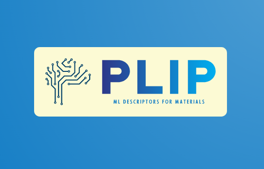

`PLIP` (Physical LassoLars Interactions Potential) is a Python package for machine learning interatomic potentials for materials modelling. Physical Lasso-Lars Interaction Potential (PLIP) has been developed to address the lack of interpretability of MLIPs. PLIP uses a physically motivated mathematical formulation for the potential and a constrained linear regression to fit the linear coefficients that determine the preponderance of each contribution to the potential. The MLIP is constructed as a linear combination of classical interactions, including two-body, three-body, and many-body interactions. These interactions are made up of simple functions such as Lennard-Jones, Gaussian, and Slatter-type orbitals, as well as explicit angular functions and embedded atom-like interactions. The Lasso-Lars regression used in PLIP imposes most coefficients to be equal to 0, resulting in a simplified final expression that retains only the main physical nature of the interactions.
# Installation
```
git clone https://github.com/LAM-GROUP/PLIP.git
cd  plip
pip install -e .
```

# Short description of PLIP code

 The method consists of 3 steps:

* **XMAT** 

    Construct matrices with each row corresponding to a force (X,Y,Z) on a specific atom and each column corresponding to a descriptor. The input arguments required are:

 
* **Lasso**

    Read the matrices and the DFT forces to construct the PLIP using LassoLars. 

* **GenPot**

    Read the obtained linear coefficients and construct the LAMMPS file for the potential. 


# Documentation
The full documentation is available here.

# Authors
The PLIP package was  developed by Julien Lam, Akshay Krishna AK, Aurélien Roux

# Citing
```
@article{benoit2020measuring,
  title={Measuring transferability issues in machine-learning force fields: the example of gold--iron interactions with linearized potentials},
  author={Benoit, Magali and Amodeo, Jonathan and Combettes, S{\'e}gol{\`e}ne and Khaled, Ibrahim and Roux, Aur{\'e}lien and Lam, Julien},
  journal={Machine Learning: Science and Technology},
  volume={2},
  number={2},
  pages={025003},
  year={2020},
  publisher={IOP Publishing}
}
```
# License
The PLIP package  is distributed under terms of [GNU GPLv3](https://github.com/LAM-GROUP/PLIP/LICENSE).