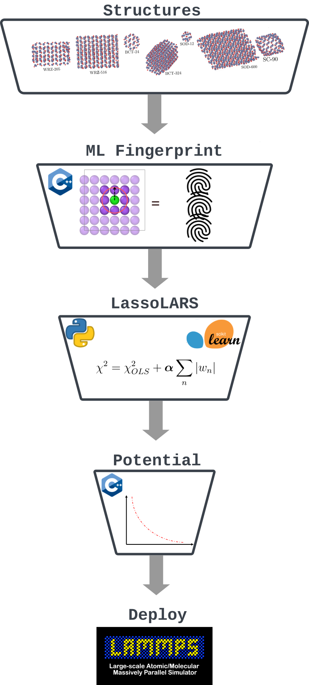

Introduction
============
Overview of PLIP
-------------------

The Physical LassoLars Interaction Potential
(PLIP) is a python package for generating machine learning interatomic potetnials (MLIP) for atomistic simulations.
A key issue related to the current MLIP methods that are often designated as "black boxes" is the lack of physical
and chemical interpretability of the obtained potential. The PLIP method combines a physically motivated mathematical formulation for the
potential `PLIP descriptors <plip_>`_ and a constrained linear regression. The plip model can be deployed in `LAMMPS <lammps_>`_ to perform high-performance molecular dynamics simulations.

.. _plip: https://journals.aps.org/prb/abstract/10.1103/PhysRevB.107.174106
.. _lammps: https://docs.lammps.org/

PLIP layout
-----------

The process of generation of PLIP based machine learning interatomic potentials can be divided into three parts :

*  Generation of plip fingerprint (descriptor) for  structures in the database. In this step, the structures of interest are first converted into a set of numerical descriptors known as PLIP fingerprints. These descriptors capture relevant information about the atomic environment, such as distances, angles, and coordination numbers, which are used to characterize the local atomic interactions within the material. 
*  Optimzing the  coefficients of the descriptors with LassoLars method: Once the PLIP fingerprints have been generated for the structures in the database, the next step is to perform LassoLars fitting.
*  Generating LAMMPS compatible potentials: In the final step, LAMMPS-compatible potentials are generated based on the fitted coefficients. LAMMPS (Large-scale Atomic/Molecular Massively Parallel Simulator) is a widely used molecular dynamics simulation software. 

