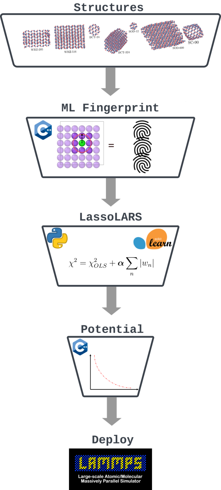

# Summary
Molecular Dynamics (MD) simulations play a crucial role in understanding and predicting the structure and properties of materials. These simulations involve studying the motion of atoms by integrating Newton's equation of motion for a group of atoms. However, the accuracy of the MD heavily relies on the employed interatomic potential (force field), which has been a significant challenge to develop with high reliability and accuracy. In recent years, machine-learned interatomic potentials (MLIP) have gained popularity due to their superior accuracy when compared to conventional force fields. The main principle behind MLIP involves utilizing a large set of quantum-accurate calculations to adjust parameters within a universal mathematical formulation representing the interaction potential. Despite their high accuracy, MLIP's   often lack physical interpretability, rendering them  as "black boxes" requiring careful fine-tuning. 

In this work, we have developed an alternative MLIP called Physical LassoLars Interaction Potential (PLIP) which combines a physically motivated mathematical formulation for the potential, optimized with a constrained linear regression algorithm. The primary goal of PLIP  package is to provide a transparent and interpretable machine-learning interaction potential while maintaining accuracy and efficiency. The development of an accurate and interpretable interatomic potential is highly useful, as it can provide deeper insights into material behaviors and facilitate the design of new materials with desired properties for diverse applications.

# Statement of need
PLIP is a hybrid python/C++ package for constructing interpretable MLIP for atomic simulation of materials. The construction of the PLIP interaction potential involves several key steps. First, the local atomic environment is represented using a combination of translational, rotational, and permutational invariant descriptors. These descriptors encode crucial information about the positions and orientations of neighboring atoms around a central atom. Different models for descriptors have been proposed in the literature, such as moment tensors[@Novoselov2019Jun], atom-centered symmetry functions (ACSFs)[@Behler2011Feb], smooth overlap of atomic positions (SOAP)[@Bartok2013May], bispectrum components[@Bartok2013May,@Thompson2015Mar], among others. Among these alternatives,we chose to use explicitly two-body, three-body, and N-body descriptors with the following equations:

$$
\begin{aligned}
&[2B]_n^i = \sum_j f_n(r_{ij}) \times f_c(r_{ij}), \\
&[3B]_{n,l}^i = \sum_j \sum_k f_n(r_{ij})f_c(r_{ij}) f_n(r_{ik})f_c(r_{ik})cos^l(\theta_{ijk}),  \\ 
&[NB]_{n,m}^i = \left( \sum_j f_n(r_{ij}) \times f_c(r_{ij}) \times f_s(r_{ij}) \right)^m,
\end{aligned}
$$

where $r_{ij}$ is the distance between atoms $i$ and $j$, $\theta_{ijk}$ is the angle centered around the atom $i$, and $l$ ($\leq 5$) and $m$ ($\leq 7$) are two positive integers.
A detailed comparison  of  PLIP  and ACSFs descriptors can be found in [@Kandy2023May].

Once the descriptor space is defined, the next step involves applying an efficient  machine learning algorithm.  Specifically, PLIP employs a simple constrained  linear regression method known as the Lasso regression, employing the Least Angle Regression (LARS) algorithm. The Lasso regression helps in selecting important descriptors and effectively reducing the complexity of the model by setting the coefficients of irrelevant descriptor coefficients to zero, making the final MLIP more robust.

Several efficient MLIP packages such as n2p2[@Singraber2019Mar], QUIP[@Bartok2010Apr], DeepMD[@Wang2018Jul], NequIP[@Batzner2022May], FitSNAP[@Rohskopf2023Apr] and ACE[@Drautz2019Jan], to name a few,  are available in the literature. These packages differ in the choice of descriptors and ML algorithms used. The MLIP potentials generated by PLIP can be utilized with a modified version of the large-scale molecular simulation software LAMMPS[@Thompson2022Feb] . Furthermore, the PLIP-generated MLIP potentials have been successfully employed in investigating  properties of gold-iron nanoparticles [@Benoit2020Dec] and nucleation in bulk zinc oxide [@Goniakowski2022Oct]. This demonstrates the practical and valuable applications of PLIP package in atomistic simulations. 

# Functionality

The PLIP software package can be primarily divided into three parts.  Firstly, the generation of machine learning descriptors for structures provided in the data set. The PLIP package makes use of efficient C++ routine to generate the ML descriptors, and this is achieved with the `XMAT` class. PLIP currently supports two-body, three-body and N-body descriptors. The basis functions for the descriptors can be chosen from functions like Gaussian's, Lorentzian or asymmetric log-normal functions. The three-body descriptor formulation is very similar to the Stillinger–Weber potential [@Stillinger1985Apr] and N-body descriptors are generalized form of the embedded atom potential (EAM) [@Daw1984Jun] .

In the second part, the fitting procedure is performed using Lasso regression with the Least Angle Regression Scheme (together LassoLars). The PLIP package makes use of the efficient LassoLars implementation in scikit-learn python machine learning package to optimize the coefficients. 

In the third and final part, the optimized coefficients are converted to LAMMPS compatible potentials. This is performed by the `GENPOT` routine written in C++. The two-body potentials are tabulated as spline tables. The three-body and N-body potentials are stored as LAMMPS compatible  Stillinger-Weber and EAM format respectively.  To use three-body and N-body potentials a custom  version of LAMMPS is required.  A general layout for  plip package is shown in fig \ref{fig}.

# Funding
This project has been funded in part by the ANR under the grant agreement ANR-21-CE09-0006. Computational resources have been provided by regional computational center CALMIP in Toulouse, Jean Zay at IDRIS, national computing centre for the CNRS, and TGCC HPC infrastructure. 

# References
